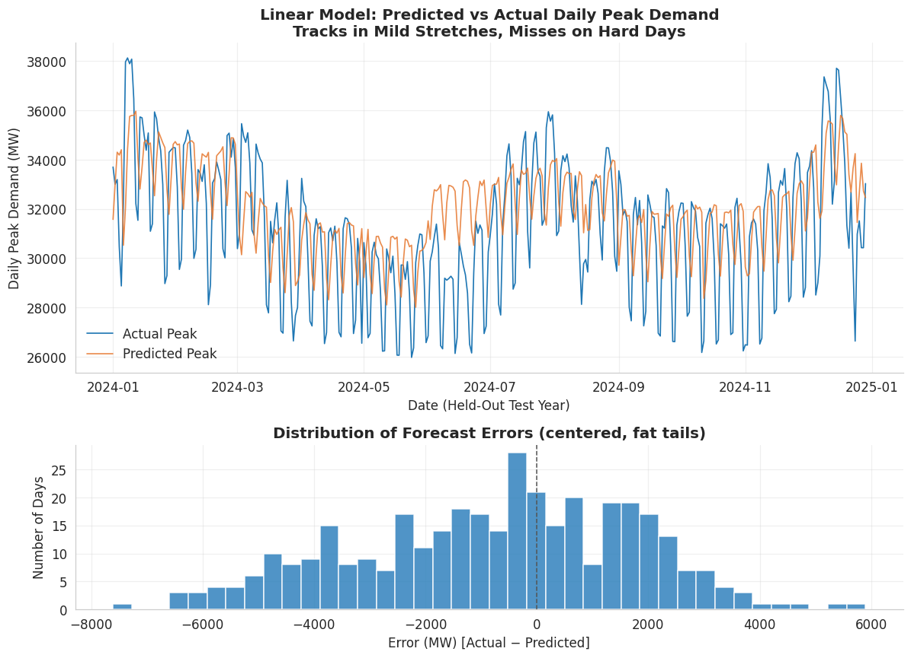
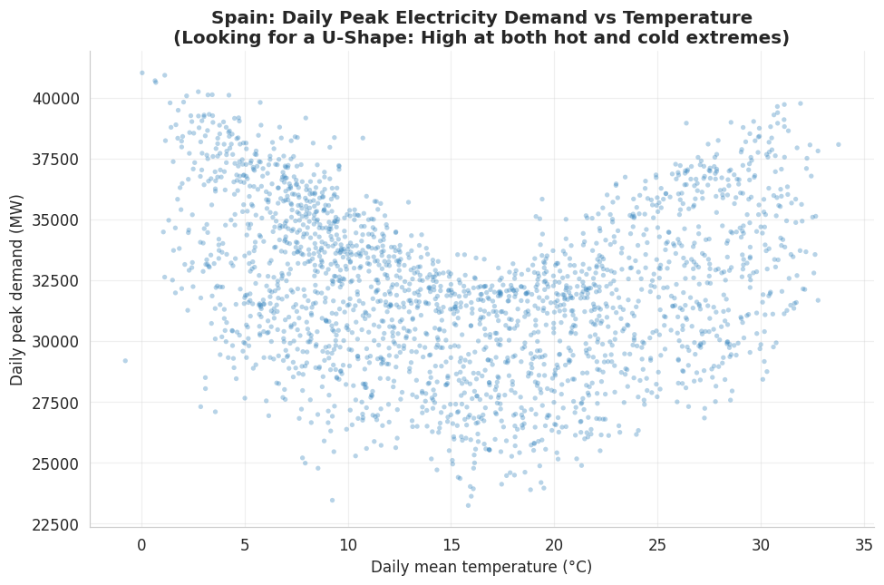
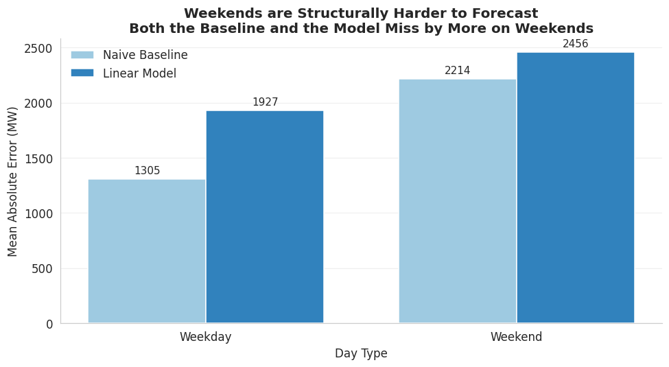

# When Simple Beats Sophisticated: Forecasting Spain's Peak Electricity Demand
*Can a model built from weather and calendar features predict tomorrow's peak electricity demand better than the trivial guess that tomorrow will look like today? The question was locked before the data was pulled. The trivial guess won by 33%. But it didn't win everywhere and finding the one place it lost is where this project earns its keep.*

***Stack: Python · pandas · SQL (SQLite) · scikit-learn · matplotlib/seaborn · ENTSO-E · Open-Meteo (ERA5)***

---

**Overview**

The model lost and thats the interesitng part. On the held-out year, its forecasts were off by about 6.6% of daily demand on average, which is worse than a one-line rule that just carries yesterday's peak forward. That result came out of a three-source SQL pipeline (ENTSO-E demand, Open-Meteo weather, a derived calendar) feeding a pre-registered linear regression, and the naive baseline beat it by 32.8%. 

That result was expected going in. Persistence baselines are famously tough to beat on autocorrelated data like electricity demand, so the real work was never "will the model win" but to investigate why it loses, and see what that investigation turns up. It turned up something useful,  on weekends, a more flexible model actually beats the baseline. That's the one place added sophistication pays for itself, and it's a sharper target for forecasting effort than anything the model could offer overall.

The takeaway isn't that the model works. It's that teams should avoid spending budget on feature-based models for everyday forecasting, where a simple rule is already the ceiling, and focus that effort on weekends, where a better model actually helps.

| Approach | Test MAE (MW) | Result |
|---|---|---|
| **Naive persistence** (tomorrow = today) | **1,565** | the benchmark to beat |
| Feature-based model (temperature + calendar) | 2,078 | 32.8% higher — the extra complexity doesn't pay off |
| Non-linear model (gradient boosting, untuned) | 1,872 | 19.6% higher overall, but beats the baseline *on weekends* |

*Held-out test: all of 2024 (364 days), trained on 1,821 prior days.*

---

## What the Analysis Found

**1. The loss is a useful result, because the question was locked first.**
The model, the metric, and the baseline were all fixed before any data was seen, so the result is an honest answer to a fair question. Daily peak demand is highly autocorrelated, which is exactly why "assume tomorrow looks like today" is such a hard baseline to beat.

**2. Two obvious explanations were tested and ruled out.**
Before blaming the model, I checked whether the features were the problem. A lag-only model being trained on nothing but yesterday's peak scored *worse* (2,211 MW) than the full model (2,078 MW). So the seven features do help, they knock 133 MW off the error. But the **the features measurably helped, and the model still lost to a rule that uses no features at all.** Then I checked whether the model's *shape* was wrong by fitting a gradient-boosting model that can capture non-linear demand patterns. It also lost to the baseline overall. Neither the features nor the model shape is the culprit.

**3. The real reason it loses: it underuses the one signal that matters most.**
Yesterday's peak is the strongest predictor in the dataset as it correlates with tomorrow's peak at 0.4, higher than any other feature. But when the linear model builds its forecast, it only leans on that signal at a weight of **0.3**. The naive baseline leans on it at full strength, effectively **1.0**. So the model dilutes exactly the thing it should be trusting most. Three numbers tell the whole story: **0.4 says yesterday's peak matters, 0.3 is how little the model uses it, 1.0 is what the winning baseline uses.**

> **Model behaviour over the test year.** The forecast tracks well through calm stretches and misses on hard days. The error distribution below is centred on zero but has fat tails. The model isn't uniformly mediocre, it's mostly fine with a handful of large misses. That pattern shows up in the numbers too as the model's RMSE (2,616 MW) sits well above its MAE (2,078 MW), a 538 MW gap that says a few bad days are doing most of the damage.

 

**4. The same error analysis found where a better model actually wins: weekends.**
Slicing the errors by day type turned up the one genuinely useful pattern. Every method struggles more on weekends but not equally. The naive baseline degrades hardest, its error jumping 69.7% from weekday to weekend (1,305 to 2,214 MW). The linear model degrades less (1,927 to 2,456 MW, +27.5%). The non-linear model degrades least of all (1,802 to 2,046 MW, +13.5%) and crucially, its weekend error of 2,046 MW comes in *below* the baseline's 2,214 MW. **That's the only place any model beats the baseline outright.** It's a real reversal of the headline: added sophistication is dead weight in general, but on weekends it earns its keep.

 

> **Weekends are harder for every method except the nonlinear model, which is the only one that beats the baseline there.** Three methods, weekday vs weekend. All three bars rise on weekends, but only the non-linear model's weekend bar drops below the baseline line.

 

**5. A second pre-registered guess was wrong.**
I expected forecast errors to spike at temperature extremes: the hottest and coldest days, where heating and cooling demand should be hardest to pin down. The opposite happened. The **mildest** days (12–20°C) were hardest to predict (2,239 MW average miss); the **hottest** days (above 28°C) were easiest (1,479 MW).

---

## Business Context

**Don't build a feature-based model for everyday peak forecasting.** A simple persistence rule is already the ceiling. The extra features, the temperature data, the seasonal terms, none of it beats just carrying yesterday's number forward. That's a resourcing call, tested rather than assumed telling a team where *not* to spend modelling time.

**If forecasting effort goes anywhere, put it on weekends.** That's the one regime where a more flexible model measurably helps, the only place any model here beat the baseline. That makes weekends a much sharper target for improvement than the vague goal of "better forecasting" overall, and it's the one place where added complexity justifies its cost.

The transferable point isn't the electricity. It's the method, a cheap, honest test that tells a team both where their effort *won't* pay off and where it *will*, before the budget is spent.

---

## The Data Engineering (the SQL work)
Three sources, joined relationally, the way it would be done in production:

- **Demand:** ENTSO-E hourly actual load for Spain (reduced to a daily peak).
- **Weather:** Open-Meteo ERA5 hourly temperature (daily max/min/mean).
- **Calendar:** Day-of-week, month, season, holiday, weekend (derived), zero leakage risk.

All three loaded into **SQLite** and combined with a real three-source `INNER JOIN` on a daily date key (2,189 joined rows, zero missing values). The data is small enough that pandas could technically do this join but SQL is used here because it's the relational, production-realistic approach and because it's a near universal tool used in the industry, not because of scale. The actual engineering challenge was upstream: getting three independently-sourced date columns onto one consistent, timezone-clean key so the join means something.

Built around one `COUNTRY_CODE` parameter, the same pipeline runs on any ENTSO-E country by changing a single value.

---

## Methodology
- **Model:** linear regression as the primary model — an interpretable baseline, tested afterward against a gradient-boosting model to check whether added complexity was worth it.
- **Split:** Chronological (train on earlier years), test on the held-out most recent year (2024). Never shuffled, since a forecast has to be evaluated the way it's actually used: predicting forward in time.
- **Leakage control:** Every input is knowable on the day it's used, same-day peak is excluded, and checked explicitly via correlation (max 0.4 no red flags).
- **Validation:** no hyperparameter tuning, so no separate validation set — a straight two-way split. The gradient-boosting comparison was left deliberately untuned, so its result is a fair test, not a forced win.
- **Metrics:** MAE (average miss in MW, easy to explain to non-technical stakeholder) as the headline. RMSE as a secondary check for large misses.

---

## The Temperature Assumption 

> **Daily peak demand against temperature.** The reason for testing a weather-based model at all is that demand looks like it should climb at both temperature extremes (heating when it's cold, cooling when it's hot). This is what the model was built to exploit. It's also the intuition the error analysis later contradicted, which is exactly why its tested instead of being assumed.

 

And here's the result that intuition ran into:

> **Nothing beats persistence.** All three methods, side by side. Both model bars sit above the naive baseline line, the simple rule is the ceiling, gradient boosting included.

 

---

## Limitations
- Trains on **actual** temperature; a real deployment would use **forecast** temperature, adding its own error. Forecasted data is available but not for the time span's entirety.
- Single-city temperature (Madrid) proxies national weather.
- 2020–2021 excluded (COVID demand shock decoupled demand from its normal drivers).
- Two production model, tested honestly against a simple baseline. Nothing was tuned to force a favourable result.

## Future Work
- Diagnosing the weekend signal, is it stable, or does it swing year to year? 
- Understadning why the Non-Linear model predicts weekends better than its counterparts 
- Population weighted multi-city temperature.
- Forecast temperature at a fixed lead time, to make the test reflect real deployment.

## Reproduce
bash
pip install -r requirements.txt
*add your ENTSO-E API token as an environment variable, then run the notebook top to bottom.*

Outputs: `data_aligned.csv` (model-ready data) and `results_summary.csv` (headline metrics).

## Attribution & Disclaimer
Weather data:
[Open-Meteo.com](https://open-meteo.com/), licensed CC BY 4.0. 
Demand data:
**ENTSO-E Transparency Platform**. 
Educational / portfolio project not an operational forecasting tool.
